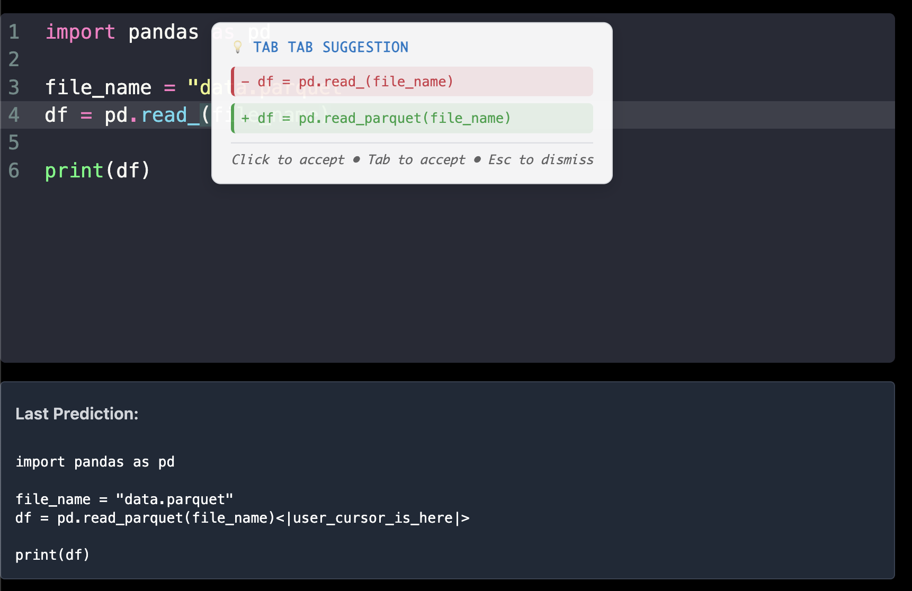

# codemirror-copilot

[](https://www.npmjs.com/package/codemirror-copilot)

This CodeMirror extension lets you use AI models to provide intelligent code suggestions in CodeMirror. Unlike traditional autocomplete, it shows **diff-based suggestions** that display the visual difference between your current code and the AI's suggested changes, making it easier to understand what will be modified.



## Features

- **Diff-based suggestions**: See exactly what will change with visual diff highlighting
- **Click to accept**: Click on suggestions to apply them
- **Tab to accept**: Press Tab to accept the current suggestion
- **Escape to dismiss**: Press Escape to dismiss suggestions
- **Smart caching**: Local caching to avoid unnecessary API calls
- **Edit tracking**: Tracks your edits to provide better context to the AI

## Demo

https://copilot.asadmemon.com

## Installation

```bash
npm install codemirror-copilot --save
```

## Usage

```javascript
import CodeMirror from "@uiw/react-codemirror";
import { javascript } from "@codemirror/lang-javascript";
import { inlineCopilot } from "codemirror-copilot";

function CodeEditor() {
  return (
    <CodeMirror
      value=""
      height="300px"
      extensions={[
        javascript({ jsx: true }),

        // Implement a function that returns a promise that resolves to the prediction
        inlineCopilot(async (prefix, suffix, patch) => {
          const res = await fetch("/api/autocomplete", {
            method: "POST",
            headers: {
              "Content-Type": "application/json",
            },
            body: JSON.stringify({ 
              prefix, 
              suffix, 
              language: "javascript",
              lastPatch: patch // Include patch information in the request
            }),
          });

          const { prediction } = await res.json();
          return prediction;
        }),
      ]}
    />
  );
}
```

## How It Works

The extension works by:

1. **Tracking your edits**: Monitors changes to understand your coding patterns
2. **Sending context to AI**: Sends your current code, cursor position, and edit history to your AI service
3. **Receiving suggestions**: Gets back a complete rewrite or modification of your code
4. **Showing visual diff**: Displays the difference between your current code and the AI's suggestion
5. **Applying changes**: When you accept, it replaces your current code with the AI's suggestion

## API

### `inlineCopilot(apiCallingFn: (prefix: string, suffix: string, patch?: Patch) => Promise<string>, delay: number = 1000, acceptOnClick: boolean = true)`

Provides extension for CodeMirror that renders diff-based suggestions + Tab completion based on the prediction returned by the API.

**Parameters:**
- `apiCallingFn`: Function that calls your AI API and returns a promise resolving to the suggested code
- `delay`: Time in milliseconds to wait before calling the API after the user stops typing (default: 1000)
- `acceptOnClick`: Whether clicking on the suggestion will automatically accept it (default: true)

**The `patch` parameter** contains information about the last edit that occurred, including:
- `line`: The line number where the change occurred (1-indexed)
- `original`: The original line content
- `modified`: The new line content
- `contextBefore`: Optional context lines before the change
- `contextAfter`: Optional context lines after the change

The extension also implements local caching of predictions to avoid unnecessary API calls.

### Patch Format

The patch parameter contains information about the last edit in the following format:

```javascript
{
  line: 3,                    // Line number where change occurred (1-indexed)
  original: "@name = name",   // Original line content
  modified: "@name = name.capitalize", // New line content
  contextBefore: [            // Optional context lines before the change
    "class Customer",
    "  def initialize"
  ],
  contextAfter: [             // Optional context lines after the change
    "    @email = email",
    "    @phone = phone"
  ]
}
```

This corresponds to a diff like:
```
   class Customer
     def initialize
-      @name = name
+      @name = name.capitalize
       @email = email
       @phone = phone
```

### `clearLocalCache()`

Clears the local cache of predictions.

### `getLastEditPatch(): Patch | undefined`

Returns the last edit patch that was tracked.

### `clearLastEditPatch()`

Clears the last edit patch.

### `updateLastEditPatch(oldDoc: string, newDoc: string, from: number, to: number, insert: string): Patch | undefined`

Updates the last edit patch based on the provided document changes. Returns a Patch object or undefined if no change occurred.

## Example API Implementation

Here is an example API in Next.js that uses OpenAI's `gpt-3.5-turbo-1106` model:

```javascript
import OpenAI from "openai";

const openai = new OpenAI({
  apiKey: process.env.OPENAI_API_KEY,
});

async function completion(
  prefix,
  suffix,
  model = "gpt-3.5-turbo-1106",
  language,
  lastPatch
) {
  let patchInfo = "";
  if (lastPatch) {
    patchInfo = `
Last Edit:
${lastPatch.contextBefore ? `${lastPatch.contextBefore.join('\n')}` : ''}
- ${lastPatch.original}
+ ${lastPatch.modified}
${lastPatch.contextAfter ? `${lastPatch.contextAfter.join('\n')}` : ''}
`;
  }

  const prompt = `You are a code completion assistant. Analyze the user's edits and provide a complete rewrite of the marked region.

${patchInfo}

Context:
<|editable_region_start|>
${prefix}<|user_cursor_is_here|>
${suffix}
<|editable_region_end|>

Provide only the code that should replace the content between the markers.`;

  const chatCompletion = await openai.chat.completions.create({
    messages: [
      { role: "user", content: prompt }
    ],
    model,
  });

  const prediction = chatCompletion.choices[0].message.content;

  // Extract the code from <|editable_region_start|> to <|editable_region_end|>
  const code = prediction.match(/<\|editable_region_start\|>(.*?)<\|editable_region_end\|>/s)?.[1] || prediction;
  return code;
}

export default async function handler(req, res) {
  const { prefix, suffix, model, language, lastPatch } = req.body;
  const prediction = await completion(prefix, suffix, model, language, lastPatch);
  res.status(200).json({ prediction });
}
```

## Local Development

In one terminal, build the library itself by running:

```bash
cd packages/codemirror-copilot
npm install
npm run dev
```

In another terminal, run the demo website:

```bash
cd website
npm install
npm run dev
```

## Acknowledgements

This code is based on [codemirror-extension-inline-suggestion](https://github.com/saminzadeh/codemirror-extension-inline-suggestion) by Shan Aminzadeh.

## License

MIT © [Asad Memon](https://asadmemon.com)
